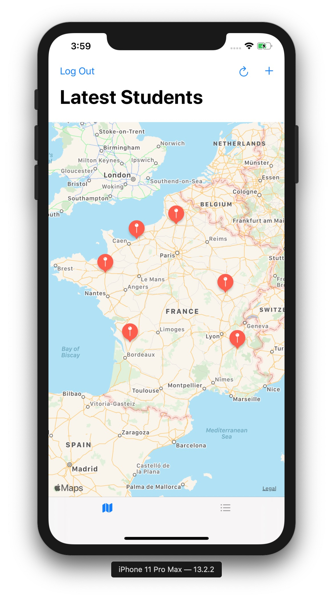
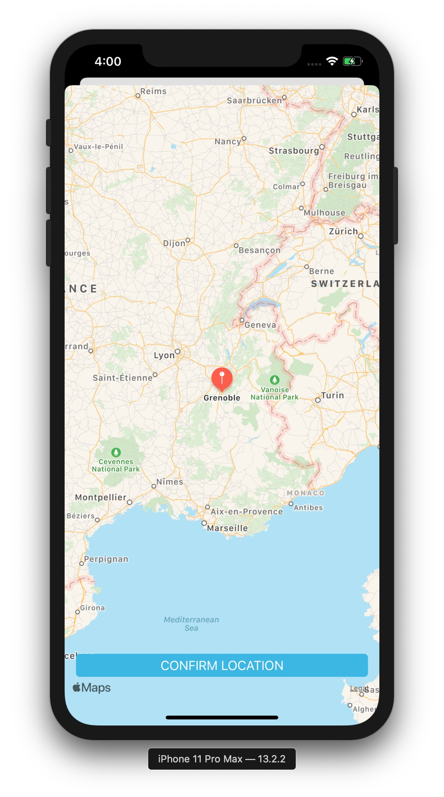

# On The Map

**On The Map** allows users to share their location and a URL with their fellow students. To visualize this data, **On The Map** uses a map with pins for location and pin annotations for student names and URLs, allowing students to place themselves "on the map", so to speak.

First, the user logs in to the app using their Udacity username and password. After login, the app downloads locations and links previously posted by other students. These links can point to any URL that a student chooses.

After viewing the information posted by other students, a user can post their own location and link. The locations are specified with a string and forward geocoded. They can be as specific as a full street address or as generic as "Costa Rica" or "Seattle, WA".

## Screenshots

    
    
    
    

## License

The content of this repository is licensed under a [MIT License](LICENSE).
